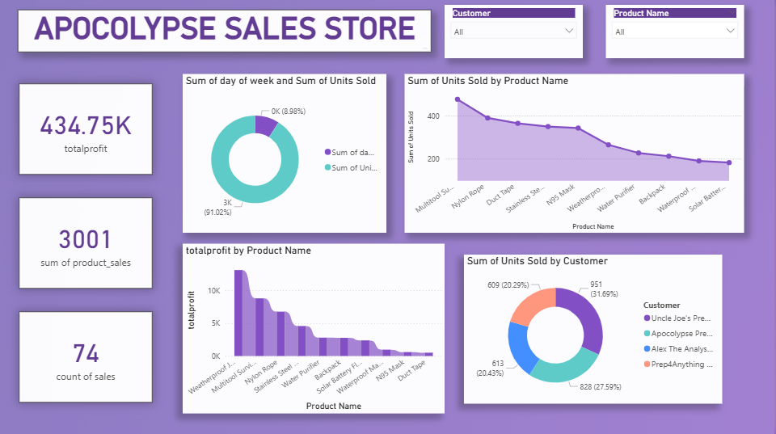

# 🛒 Apocolypse Sales Store: Performance Analysis Dashboard
End-to-End Sales Analysis & Visualization Project

## 📌 Project Overview
Project ini bertujuan untuk menganalisis kinerja penjualan dari "Apocalypse Sales Store" guna mengidentifikasi pola penjualan, produk yang paling menguntungkan, dan perilaku pelanggan. Analisis ini dirancang untuk memberikan wawasan mendalam yang dapat mendukung pengambilan keputusan strategis dalam hal pemasaran, manajemen inventaris, dan peningkatan profitabilitas.

Hasil analisis divisualisasikan dalam dashboard interaktif untuk memudahkan pemantauan KPI, eksplorasi data penjualan, dan identifikasi peluang pertumbuhan.

### Key Highlight
*   Toko berhasil mencapai **total laba sebesar 434.75K** dari **74 transaksi**.
*   Total **3,001 unit produk** berhasil terjual, menunjukkan volume penjualan yang sehat.
*   Dashboard ini memungkinkan identifikasi cepat produk-produk "bintang" yang memberikan kontribusi laba terbesar.
*   Pola penjualan dapat dianalisis berdasarkan hari, produk, dan pelanggan untuk strategi yang lebih tajam.

---

## 🗂️ Repository Structure
```
├── sales_data.csv                 # Dataset transaksi penjualan toko
├── sales_analysis.ipynb           # Analisis data dengan Python (Pandas, Matplotlib)
├── apocalypse_dashboard.pbix      # Dashboard interaktif Power BI
├── assets/
│   └── apocalypse_dashboard.png   # Preview tampilan dashboard
└── README.md
```

---

## 📊 Dashboard Preview


Dashboard menampilkan:
*   **KPI Utama:** Total Laba, Total Unit Terjual, dan Jumlah Transaksi.
*   **Analisis Hari:** Grafik lingkaran yang menunjukkan distribusi penjualan per hari dalam seminggu.
*   **Tren Produk:** Grafik garis yang membandingkan tren penjualan unit untuk setiap nama produk.
*   **Profitabilitas Produk:** Grafik batang yang mengurutkan produk berdasarkan total laba yang dihasilkan.
*   **Segmentasi Pelanggan:** Grafik lingkaran yang menunjukkan kontribusi penjualan per pelanggan.
*   Filter interaktif untuk eksplorasi data yang lebih mendalam.

---

## 🎯 Business Problem
Tanpa visualisasi data yang jelas, manajemen toko sering kali menghadapi tantangan seperti:
*   Kesulitan menentukan produk mana yang harus diprioritaskan untuk stok dan promosi.
*   Tidak mengetahui hari atau waktu paling sibuk untuk mengoptimalkan jadwal kerja staf.
*   Tidak dapat mengidentifikasi pelanggan setia yang memberikan kontribusi terbesar terhadap pendapatan.
*   Pengambilan keputusan berdasarkan firasat, bukan data yang konkret, yang berisiko menurunkan profitabilitas.

---

## 🎯 Objectives
*   Mengidentifikasi produk dengan laba tertinggi vs. produk dengan penjualan unit tertinggi.
*   Menganalisis tren penjualan harian untuk menentukan waktu terbaik untuk kampanye pemasaran.
*   Menemukan pelanggan paling berharga (top customers) untuk strategi retensi.
*   Memahami hubungan antara volume penjualan dan profitabilitas.
*   Menyediakan dashboard yang mudah digunakan untuk pemantauan kinerja penjualan harian/mingguan.

---

## 🛠️ Tech Stack & Workflow
### 1️⃣ Data Processing & Analysis (Python)
*   **Tools**: Python (Pandas, NumPy, Matplotlib)
*   **Proses**:
    *   Pembersihan data transaksi (misal: menangani nilai yang hilang, memastikan tipe data benar).
    *   Agregasi data untuk menghitung total laba, unit terjual, dan jumlah transaksi.
    *   Analisis awal untuk mengidentifikasi produk dan pelanggan teratas.

### 2️⃣ Exploratory Data Analysis
*   Analisis perbandingan profitabilitas antar produk.
*   Investigasi pola penjualan berdasarkan hari dalam seminggu.
*   Identifikasi pelanggan dengan nilai transaksi tertinggi (analisis RFM - Recency, Frequency, Monetary).

### 3️⃣ Data Visualization (Power BI)
*   Dashboard interaktif dibangun untuk menampilkan:
    *   Kartu KPI untuk metrik utama.
    *   Grafik lingkaran (Donut Chart) untuk proporsi (hari, pelanggan).
    *   Grafik garis (Line Chart) untuk tren waktu (penjualan produk).
    *   Grafik batang (Bar Chart) untuk peringkat (profit per produk).

---

## 🔍 Key Insights & Findings
### 1️⃣ Profitabilitas vs. Popularitas Produk
Dashboard memungkinkan pemisahan antara produk yang paling banyak terjual (populer) dan produk yang paling menguntungkan. Ini adalah wawasan krusial karena:
*   **Produk Populer belum tentu Menguntungkan:** Mungkin ada produk dengan margin kecil yang laku banyak, tetapi kontribusi labanya rendah.
*   **Identifikasi "Bintang" dan "Cash Cow":** Strategi pemasaran dapat difokuskan pada produk "bintang" (high profit, high sales) dan menjaga stok produk "cash cow" (high profit, lower sales).

### 2️⃣ Pola Penjualan Harian
Dari grafik "Sum of day of week", manajemen dapat mengidentifikasi hari-hari puncak (peak days). Wawasan ini dapat digunakan untuk:
*   **Jadwal Promosi:** Meluncurkan diskon atau acara khusus pada hari-hari dengan traffic tinggi untuk memaksimalkan dampak.
*   **Manajemen Staf:** Menjadwalkan lebih banyak staf pada hari sibuk untuk meningkatkan pelayanan.

### 3️⃣ Konsentrasi Pelanggan
Grafik "Sum of Units Sold by Customer" mengungkapkan apakah penjualan toko bergantung pada beberapa pelanggan besar (Prinsip Pareto 80/20) atau tersebar merata.
*   **Jika Terkonsentrasi:** Fokus pada strategi retensi pelanggan (customer retention) untuk menjaga pelanggan utama tetap loyal.
*   **Jika Merata:** Fokus pada program akuisisi pelanggan baru untuk terus memperluas basis pasar.

---

## 📌 Conclusion
Dashboard "Apocalypse Sales Store" mengubah data transaksi mentah menjadi aset intelijen bisnis yang berharga. Dengan visualisasi yang jelas dan interaktif, pemilik toko dapat:
*   **Mengoptimalkan Inventaris:** Fokus pada produk yang benar-benar mendatangkan keuntungan.
*   **Meningkatkan Targeting Pemasaran:** Menyasar pelanggan yang tepat dengan promosi yang tepat pada waktu yang tepat.
*   **Meningkatkan Profitabilitas:** Mengambil keputusan berbasis data yang secara langsung berdampak pada laba bersih.
*   Dashboard ini bukan hanya alat pelaporan, tetapi kompas strategis yang membimbing toko menuju pertumbuhan yang berkelanjutan.

---

## 👤 Author
**[Asri Sabilla Putri]** 📊 Business Intelligence Analyst
🔗 LinkedIn: [[Link LinkedIn Anda](https://www.linkedin.com/in/asrisabilla)]
🌐 Portfolio: [portofolio-asri.netlify.app]
